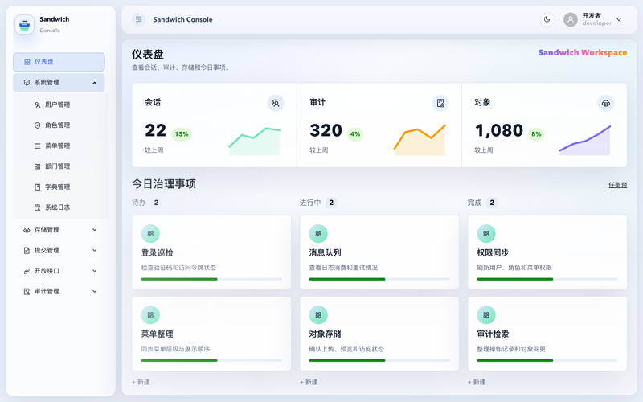

# Sandwich

旧 JeeSite 项目的 Agent-first 工程改造实践。

Sandwich 基于老 JeeSite 项目改造，固定 Java 8 / Spring Boot 2.0.5.RELEASE，不通过重写或升级技术栈绕开旧系统复杂度。项目在原有分层基础上，重新收敛模块边界、持久化隔离、入口适配、架构门禁、测试验证、React 后台规范和 Docker 最小发布流程。

它关注的不是“从零搭一个新项目”，而是：

> 旧 Java 系统如何在原有技术约束下继续演进，并让 AI Agent 也能读得准、写得对、改得稳、上线有据可查。

<div align="center">
  
</div>

## 项目概览

- 基于老 JeeSite 项目完成 Maven 多模块治理化改造。
- 固定 Java 8 / Spring Boot 2.0.5.RELEASE，在低版本旧生态中保留真实工程约束。
- 在不推翻旧系统分层的前提下，收敛 Controller、Service、DAO、Mapper 的职责边界。
- 抽出 `sandwish-infra` 承接 DO、Mapper、DAO implementation 和持久化装配。
- 拆分 `admin-api`、`front-api`、`open-api` 三个后端入口。
- 升级 `Auth`、`Audit` 核心模块。
- 用 `Submission` 跑通新增业务板块的落地路径。
- 提供 React 后台管理系统 `sandwish-admin-web` 和对应架构规范。
- 覆盖单元测试、集成测试、冒烟测试、缓存同步验证、k6 压测和 Docker Compose 最小发布。

## 核心思想

Sandwich 继承 Bacon 的核心思想：[面向 AI Agent 的工程操作系统](https://github.com/thundax-lyp/bacon/blob/main/docs/60-human/AI-AGENT-ENGINEERING-OS-EXPLANATION.md)。

在这个项目里，文档负责上下文路由，目录负责代码落点，模块边界负责依赖方向，测试和质量规则负责门禁，TODO 与 Git 历史负责交付闭环。落到 Sandwich，重点是旧系统改造：不重写、不升版本、不绕开旧约束，而是在原架构上补齐可持续协作机制。

## 项目关系

- [Bacon](https://github.com/thundax-lyp/bacon)：从新项目出发，沉淀 Agent-first 工程协作范式。
- `Sandwich`：从旧 JeeSite 系统出发，验证同一套方法如何在 Java 8 / Spring Boot 2.0.5 / 旧系统分层约束下落地。

## 业务范围

- 后台系统管理：用户、角色、菜单、部门、字典、系统日志和权限会话。
- 认证能力：后台认证、前台会员认证、token、OAuth2、登录标识、认证凭据和认证会话。
- 开放接口：Open API client、API key/secret、签名认证、nonce 防重放和开放提交查询。
- 会员能力：前台会员主数据、会员资料和认证运行态。
- 存储能力：对象上传、分片上传、对象引用、查询、删除和对象存储适配。
- 审计能力：审计元数据、审计日志、审计快照、审计对象坐标和业务对象变更记录。
- 提交业务：`Submission` 作为新增业务板块落地路径。

## 技术栈

| 分类 | 技术 |
| --- | --- |
| 后端语言 | Java 8 |
| 后端框架 | Spring Boot 2.0.5.RELEASE |
| 构建 | Maven multi-module |
| 持久化 | MyBatis / MyBatis-Plus |
| API 文档 | Swagger / Springfox |
| 缓存与消息 | Redis / JetCache / RocketMQ |
| 对象存储 | Local File / S3 compatible storage |
| 后台前端 | React / TypeScript / Vite / Ant Design / TanStack Query |
| 质量门禁 | JUnit、ArchUnit、Checkstyle、Spotless、ESLint、Vitest、Playwright、k6 |
| 部署 | Docker Compose、nginx、MySQL、Redis、RocketMQ、MinIO |
| AI 协作 | 文档路由、任务生命周期、架构治理、提交审计 |

## 项目规模

- 业务板块：`Auth / System / Member / Open / Storage / Submission / Audit`
- 应用入口：`sandwish-admin-api`、`sandwish-front-api`、`sandwish-open-api`、`sandwish-admin-web`
- 代码规模：900+ Java 文件、200+ Java 测试、90+ TS/TSX 文件
- 文档规模：40+ 份 Markdown，覆盖治理规则、业务需求、数据库设计、专项设计、上线准备和人类阅读材料
- 验证链路：单元测试、架构测试、集成测试、冒烟测试、缓存同步验证和 k6 读链路压测

## 项目结构

```text
sandwich
├── sandwish-common/       # 共享技术能力
├── sandwish-biz/          # 业务实体、DAO interface、Service 和业务规则
├── sandwish-infra/        # DAO implementation、Mapper、DO 和持久化适配
├── sandwish-admin-api/    # 后台 API 入口
├── sandwish-front-api/    # 前台 API 入口
├── sandwish-open-api/     # 开放 API 入口
├── sandwish-admin-web/    # React 后台管理前端与架构规范
├── db/                    # 数据库脚本
├── deploy/                # Docker Compose 部署样例
├── scripts/               # 冒烟、压测等验证脚本
└── docs/                  # AI Agent 的上下文系统
```

## 关键模块

`Auth`：核心认证升级。覆盖后台认证、前台会员认证、token、OAuth2、认证会话、登录标识和凭据边界。

`Audit`：横切审计能力。覆盖审计元数据、审计日志、审计快照和业务对象坐标。

`Submission`：新增业务板块。从需求、数据库设计，到 biz、infra、API、测试、文档收口形成完整路径。

`sandwish-admin-web`：React 后台架构规范。覆盖路由、权限、API service、组件、CSS 边界和 UI 交互规则。

## 可重点查看

- 架构测试：[sandwish-biz](sandwish-biz/src/test/java/com/github/thundax/architecture)、[sandwish-infra](sandwish-infra/src/test/java/com/github/thundax/architecture)、[sandwish-admin-api](sandwish-admin-api/src/test/java/com/github/thundax/architecture)，与 [docs/00-governance/](docs/00-governance/) 下的规约文件对应
- 持久化隔离：[sandwish-biz](sandwish-biz) 与 [sandwish-infra](sandwish-infra)
- 新业务样板：[Submission](sandwish-biz/src/main/java/com/github/thundax/modules/submission)
- 文档路由：[docs/AGENT.md](docs/AGENT.md)
- 任务闭环：`git log --oneline -- TODO.md`

## 阅读路径

- 看旧系统改造：[ARCHITECTURE.md](docs/00-governance/ARCHITECTURE.md)、[ARCHITECTURE-INTENT.md](docs/00-governance/ARCHITECTURE-INTENT.md)
- 看架构边界：[NAMING-AND-PLACEMENT-RULES.md](docs/00-governance/NAMING-AND-PLACEMENT-RULES.md)、[DATABASE-RULES.md](docs/00-governance/DATABASE-RULES.md)、[sandwish-common-test](sandwish-common/sandwish-common-test)
- 看新增业务：[SUBMISSION-REQUIREMENTS.md](docs/10-requirements/SUBMISSION-REQUIREMENTS.md)、[SUBMISSION-DATABASE-DESIGN.md](docs/20-database/SUBMISSION-DATABASE-DESIGN.md)、[submission 代码](sandwish-biz/src/main/java/com/github/thundax/modules/submission)
- 看核心升级：[AUTH-REQUIREMENTS.md](docs/10-requirements/AUTH-REQUIREMENTS.md)、[AUDIT-REQUIREMENTS.md](docs/10-requirements/AUDIT-REQUIREMENTS.md)、[auth 代码](sandwish-biz/src/main/java/com/github/thundax/modules/auth)、[audit 代码](sandwish-biz/src/main/java/com/github/thundax/modules/audit)
- 看前端规范：[ADMIN-WEB-RULES.md](docs/00-governance/ADMIN-WEB-RULES.md)、[sandwish-admin-web/AGENTS.md](sandwish-admin-web/AGENTS.md)
- 看测试发布：[deploy/integration/README.md](deploy/integration/README.md)、[scripts/smoke/README.md](scripts/smoke/README.md)、[scripts/load/README.md](scripts/load/README.md)、[deploy/README.md](deploy/README.md)
- 看 AI 协作：[docs/AGENT.md](docs/AGENT.md)、[TODO-RULES.md](docs/00-governance/TODO-RULES.md)、`git log --oneline -- TODO.md`

## 复盘线索

Sandwich 保留了从旧 JeeSite 项目到 Agent-first 工程实践的演进过程。除了阅读文档和代码，也可以通过 Git 历史查看治理规则、模块边界、测试门禁和业务能力如何逐步收口。

- 项目复盘：[STORY.md](docs/60-human/STORY.md)
- AI 文档路由：[docs/AGENT.md](docs/AGENT.md)
- 任务闭环历史：`git log --oneline -- TODO.md`
- 架构治理演进：`git log --oneline -- docs/00-governance`
- 新业务落地过程：`git log --oneline -- docs/10-requirements/SUBMISSION-REQUIREMENTS.md docs/20-database/SUBMISSION-DATABASE-DESIGN.md sandwish-biz/src/main/java/com/github/thundax/modules/submission sandwish-infra/src/main/java/com/github/thundax/modules/submission`

## 本地验证

后端单元测试：

```bash
mvn test
```

集成测试：

```bash
cp deploy/integration/.env.example deploy/integration/.env
docker compose --env-file deploy/integration/.env -f deploy/integration/docker-compose.yml up -d
mvn verify -Pit
```

后台前端：

```bash
cd sandwish-admin-web
npm ci
npm run lint
npm test
npm run build
```

## 最小化 Docker 发布

构建镜像并导出：

```bash
SANDWISH_IMAGE_TAG=dev deploy/build-images.sh
```

启动 Compose：

```bash
cp deploy/.env.example deploy/.env
docker compose --env-file deploy/.env -f deploy/docker-compose.yml up -d
```

冒烟测试：

```bash
scripts/smoke/smoke-all.sh
```

k6 读链路压测：

```bash
cp .env.test.example .env.load
scripts/load/run-k6-api-read.sh
```

默认入口：

- 后台页面：`http://127.0.0.1:18080/admin/`
- 后台 API：`http://127.0.0.1:18080/admin-api`
- 前台 API：`http://127.0.0.1:18080/front-api`
- 开放 API：`http://127.0.0.1:18080/open-api`
- 内部健康检查：`http://127.0.0.1:18081/{admin-api|front-api|open-api}/actuator/health`

更多说明见 `deploy/README.md`、`scripts/smoke/README.md` 和 `scripts/load/README.md`。

## License

Apache License 2.0，详见 `LICENSE`。
